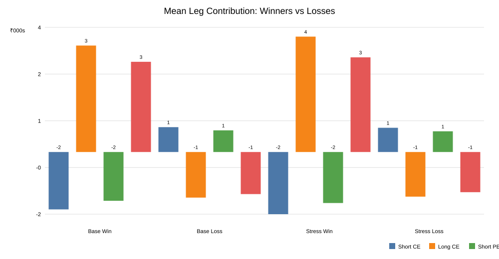

# Intraday NIFTY 1×2/1×2 Dual Ratio Backspread: Baseline Backtest and Losing-Trade Analysis

**Version:** 1.0    
**Date:** 29 September 2026  
**Repository branch:** `research/otm12-phase-e-manuscript-v1`  
**Authoritative clean baseline workflow:** 36532252218

## Abstract

This study backtests a fixed intraday NIFTY options structure: sell 1 OTM1 put, buy 2 OTM2 puts, sell 1 OTM1 call, and buy 2 OTM2 calls. The position is opened using the 09:30 IST NIFTY close to select the first and second listed out-of-the-money strikes, executed at the 09:31 IST option-bar open, and exited at the 15:15 IST option-bar open using the nearest listed expiry on or after the trade date. One lot is used, with historical NIFTY lot sizes applied by date. Base and stress transaction-cost scenarios include brokerage, exchange charges, SEBI charges, stamp duty, GST, option STT, and option-price slippage.

The clean sample contains 1,227 eligible sessions and 1,209 completed four-leg trades, for 98.53% execution coverage. The strategy is materially negative after costs: Base net P&L is -₹717,921.87 with a 25.81% win rate and profit factor 0.517; Stress net P&L is -₹874,857.87 with a 23.90% win rate and profit factor 0.454. The central research question was not only whether the strategy is profitable, but what distinguishes losing trades from profitable trades and whether a simple pre-entry avoidance rule can be supported out of sample.

The main repeatable loser regime is **high prior-day range combined with very near expiry**: prior-day range above 1.314516% and no more than 1.5 calendar days to expiry. This rule was frozen using the discovery sample only. On the untouched 2025+ holdout it removed 24 of 348 trades (6.90%) and improved aggregate net P&L by ₹67,879 in Base and ₹71,911 in Stress. However, the retained strategy remained negative at -₹663.91/trade Base and -₹836.94/trade Stress. The evidence therefore supports a concentrated loss regime and a possible loss-avoidance condition, but **does not establish a profitable standalone trading strategy**.

## 1. Research question

### Primary question

For the fixed one-lot four-leg structure, what pre-entry market circumstances are associated with profitable versus losing trades, and is there a stable, non-look-ahead circumstance that can be used to avoid a disproportionate share of losses?

### Secondary questions

1. Does the raw structure have positive expectancy after realistic trading frictions?
2. Which pre-entry features differ most between winners and losers?
3. Does a shallow interpretable model provide meaningful discrimination of losses?
4. Does a discovery-derived loss regime replicate on an untouched chronological holdout?
5. Does removing that regime make the retained strategy profitable, or only less unprofitable?

## 2. Literature review and theoretical rationale

Ratio backspreads are asymmetric option structures that combine a short nearer strike with a larger quantity of further-strike long options. Educational references describe them as structures whose payoff improves after a sufficiently large move beyond the long strike, while the interval between the short and long strikes can contain the loss zone. The Options Industry Council explicitly describes ratio spreads/backspreads in terms of unequal quantities and their sensitivity to direction and implied volatility; Zerodha's treatment of the call ratio backspread similarly emphasizes the 2:1 construction and dependence on a large underlying move. A 2025 academic thesis using Asian options also reports that call ratio backspreads can exhibit stronger upside in high-volatility conditions but with higher risk. These sources are not substitutes for the present NIFTY intraday experiment, but they establish the expected payoff geometry.

Academic option-pricing research provides additional context. Gârleanu, Pedersen and Poteshman (2009) model option prices as partly reflecting demand pressure and imperfect hedging, while Bondarenko (2014) documents persistent option-pricing anomalies in U.S. index puts. These findings motivate treating option-premium geometry as an empirical variable rather than assuming that a nominally symmetric-looking structure has zero-cost exposure to volatility, skew or demand effects.

The strongest methodological literature for this study concerns backtest overfitting. Bailey and López de Prado (2014) describe performance inflation caused by repeated strategy selection and propose the Deflated Sharpe Ratio. Bailey, Borwein, López de Prado and Zhu (2015/2017) formalize the Probability of Backtest Overfitting and emphasize the distinction between in-sample discovery and out-of-sample validation. The present design follows that principle by freezing the strategy, separating discovery and holdout periods, and refusing to modify thresholds after observing holdout results.

**Literature gap.** A targeted search did not identify a peer-reviewed empirical study matching the exact specification tested here: a same-expiry NIFTY intraday 1×2 put backspread combined with a 1×2 call backspread, entered at a fixed morning timestamp and exited before the close with realistic Indian transaction costs. The closest literature supports the payoff/volatility intuition and the need for strict out-of-sample testing, but does not establish this exact strategy.

## 3. Frozen strategy definition

- Underlying: NIFTY index options.
- Position size: 1 lot.
- Entry reference: NIFTY 09:30 IST close.
- Executable entry: 09:31 IST option-bar open.
- Expiry: nearest listed NIFTY expiry on or after the trade date.
- OTM1 call: first listed strike strictly above the 09:30 NIFTY reference.
- OTM2 call: second listed strike above OTM1.
- OTM1 put: first listed strike strictly below the 09:30 NIFTY reference.
- OTM2 put: second listed strike below OTM1.
- Quantities: short 1 OTM1 CE, long 2 OTM2 CE, short 1 OTM1 PE, long 2 OTM2 PE.
- Exit: 15:15 IST option-bar open.
- A 15:14 fallback was implemented for missing 15:15 data, but no completed trade in the clean sample used the fallback; all 1,209 completed trades exited at 15:15.
- No stop-loss, target, leg replacement, discretionary re-entry, strike optimization or post-result tuning.

## 4. Data and execution methodology

The pinned market-data source is the Hugging Face dataset `thetrademarkk/india-index-options-1m`, revision `51ca58c`. The source provides one-minute index and option data with strike, option type and expiry fields; its documentation also notes that option coverage can be sparse for illiquid or far-out-of-the-money contracts. The workflow caches the pinned dataset and reuses it rather than downloading it on every calculation.

The historical window is 1 July 2021 through 4 August 2026. The index session gate requires the 09:15 open, 09:30 reference, prior-session information, and the opening 15-minute feature window. Historical NIFTY lot sizes are applied by date.

### Transaction-cost model

The Base case uses ₹0.20 option-price-point slippage per side; Stress uses ₹0.40. The engine additionally applies the repository's established brokerage/exchange/SEBI/stamp-duty/GST/STT convention, including ₹40 per option-leg round trip. Costs are computed per trade using the applicable historical lot size and date-specific statutory rates.

## 5. Data-integrity and implementation controls

Several implementation defects were discovered before accepting any P&L. All were corrected and logged:

1. Missing `huggingface_hub` dependency.
2. DuckDB timezone-casting incompatibility.
3. Option/session `trade_date` type mismatch, which initially caused every four-leg trade to be rejected despite valid 09:31/15:15 option bars.
4. A read-only pandas quantile array during feature-bin reporting.
5. Two Phase-C/Phase-D analysis-only reporting/dataframe defects.

A dedicated timestamp probe verified that the option dataset contains the required 09:31 and 15:15 IST bars. The final clean baseline workflow passed all steps in both Base and Stress.

## 6. Baseline results

| Metric | Base | Stress |
|---|---:|---:|
| Eligible sessions | 1,227 | 1,227 |
| Completed trades | 1,209 | 1,209 |
| Execution coverage | 98.53% | 98.53% |
| Wins | 312 | 289 |
| Losses | 897 | 920 |
| Win rate | 25.81% | 23.90% |
| Gross P&L | -₹272,009.75 | -₹272,009.75 |
| Total costs | ₹445,912.12 | ₹602,848.12 |
| Net P&L | **-₹717,921.87** | **-₹874,857.87** |
| Mean net P&L/trade | -₹593.81 | -₹723.62 |
| Median net P&L/trade | -₹915.50 | -₹1,032.73 |
| Mean winning trade | ₹2,459.89 | ₹2,521.14 |
| Mean losing trade | -₹1,655.97 | -₹1,742.90 |
| Profit factor | 0.517 | 0.454 |
| Max drawdown | -₹716,320.49 | -₹873,136.49 |

The strategy is negative in every calendar year available in the sample. The most adverse year is 2025, when Base net P&L is approximately -₹249k and Stress approximately -₹293k.

Expiry-day trades are also worse on average. Base mean net P&L is -₹906.65 on expiry days versus -₹511.03 on non-expiry days. Stress is -₹1,036.37 versus -₹640.85.

## 7. Winner-versus-loser analysis

Discovery period: 1 July 2021 through 31 December 2024.

A descriptive Mann–Whitney comparison was performed for the preregistered pre-entry feature family. No single feature showed a stable, large effect across Base and Stress. Some features, such as entry spot in the Stress sample, produced smaller p-values, but this was not treated as a trading signal because the effect did not form a stable, economically interpretable rule across frictions.

The most consistent feature direction was modestly higher first-15-minute absolute movement and somewhat larger option premium totals among winners. These differences were small relative to the distribution of P&L and were not sufficient to produce a profitable univariate filter.

### Profit mechanism observed ex post

The leg-level decomposition is highly informative about what a winning trade actually requires:

- In both Base and Stress, **100% of winning trades had at least one of the call-side or put-side combined contributions positive**.
- Only about 6.4%–6.6% of winning trades had both side contributions positive, showing that the typical winner is a one-sided expansion rather than a simultaneous two-sided explosion.
- Among losing trades, only about 55%–56% had at least one side contribution positive.

For Base wins, mean contributions were approximately -₹1,801 from the short call, +₹3,341 from the long calls, -₹1,528 from the short put, and +₹2,830 from the long puts. Losses showed the reverse pattern: the short legs appreciated against the position while the long wings failed to appreciate enough.

This is a **post-entry diagnostic**, not an admissible entry filter. It shows the economic mechanism of profit: the underlying has to move far enough, fast enough, on at least one side for the 2× long wing to overcome the 1× short OTM1 leg and trading costs.

## 8. Discovery of the common loser regime

A shallow regression tree with depth 3 and minimum leaf size 50 was used only as an interpretable discovery tool. The strongest repeatable high-loss leaf in both frictions corresponds to:

> **prior-day full-session range > 1.314516% AND days to expiry <= 1.5 calendar days**

This condition is economically plausible for the tested structure. Large prior-day movement combined with very little time remaining places the position in a region where the entry is occurring close to expiry but after the market has already displayed substantial range. The long wings have little time to benefit from a sufficiently large follow-through move, while the structure remains exposed to the loss valley between the short and long strikes.

The candidate regime had discovery results:

| Friction | Trades | Win rate | Mean P&L | Total P&L |
|---|---:|---:|---:|---:|
| Base | 69 | 18.84% | -₹1,474.91 | -₹101,768.81 |
| Stress | 69 | 14.49% | -₹1,587.95 | -₹109,568.81 |

The discovery-only loss classifier itself was weak. Cross-validated ROC-AUC was 0.481 Base and 0.384 Stress. This lack of stable classification power is important: the rule is a narrow loss-concentration regime, not a complete model of winners and losers.

## 9. Frozen holdout test

Holdout period: 1 January 2025 through the last complete session in the pinned dataset.

The filter thresholds were frozen before reading holdout performance.

**Frozen rule:** do not enter when prior-day range > 1.314516% and days to expiry <= 1.5 calendar days.

| Friction | Holdout baseline | Blocked by filter | Kept after filter |
|---|---:|---:|---:|
| Base trades | 348 | 24 | 324 |
| Base win rate | 27.59% | 25.00% | 27.78% |
| Base net P&L | -₹282,985.19 | -₹67,879.06 | **-₹215,106.13** |
| Base mean/trade | -₹813.18 | -₹2,828.29 | **-₹663.91** |
| Stress trades | 348 | 24 | 324 |
| Stress win rate | 26.72% | 25.00% | 26.85% |
| Stress net P&L | -₹343,081.19 | -₹71,911.06 | **-₹271,170.13** |
| Stress mean/trade | -₹985.87 | -₹2,996.29 | **-₹836.94** |

The blocked trade mean has a 95% bootstrap confidence interval of approximately [-₹4,522, -₹1,244] in Base and [-₹4,689, -₹1,411] in Stress. The retained sample also remains clearly negative.

The filter removes only 6.90% of holdout trades but reduces the aggregate loss by about 23.99% of the Base holdout deficit and 20.96% of the Stress deficit. This is useful as a diagnostic avoidance rule, but not a profitability transformation.

## 10. Statistical interpretation

The study deliberately uses descriptive inference rather than claiming confirmatory significance for a heavily searched strategy family.

- The baseline result is economically large and negative under both friction assumptions.
- Feature-level winner/loser differences are small and inconsistent across frictions.
- The shallow loss classifier is not useful as a stable prediction model.
- The high-prior-range/near-expiry regime is independently visible in discovery and holdout, and the blocked subset remains significantly negative under bootstrap confidence intervals on its mean.
- Nevertheless, the retained strategy's confidence interval remains below zero. The filter therefore identifies a concentrated source of losses but does not produce a positive-expectancy strategy.

This separation between **loss-concentration evidence** and **profitability evidence** is important for avoiding backtest overfitting.

## 11. Strengths

1. Frozen strategy definition and chronological discovery/holdout split.
2. Explicit transaction costs and two slippage scenarios.
3. Historical lot-size adjustments.
4. Timestamp integrity probe and stage-level execution diagnostics.
5. Winner/loser analysis restricted to pre-entry variables when evaluating a prospective filter.
6. Separate holdout replication with no threshold tuning.
7. Reproducible GitHub Actions workflows with pinned data revision.

## 12. Limitations

1. The option-data source has incomplete coverage for some contracts, especially illiquid or far OTM options. The clean execution coverage is high but not 100%.
2. The historical monetary P&L changes with NIFTY lot-size regimes, so rupee sums should not be interpreted as a constant-capital return series.
3. The backtest uses bar opens rather than order-book bid/ask microstructure. Slippage scenarios partially compensate but do not reproduce every intraday execution effect.
4. The strategy exits at a fixed time. Different exits were intentionally not optimized in this study.
5. No implied-volatility surface, option Greeks, VIX-equivalent signal, FII/DII flow, or event/news filter was added to this branch; these are directions for further research, not hidden variables used to explain the present result.
6. The discovery analysis uses multiple descriptive features. P-values are not adjusted to serve as confirmatory hypothesis tests.

## 13. Conclusion

The fixed NIFTY 1×2 put-backspread plus 1×2 call-backspread structure is **not profitable on the tested historical sample after realistic transaction costs**. Base net P&L is -₹717.9k and Stress net P&L is -₹874.9k over 1,209 completed trades.

The most useful finding is not a new profitable entry signal. It is a **loss-concentration regime**: when the previous day's NIFTY range is already above about 1.31% and the selected expiry is within approximately 1.5 calendar days, the strategy produces disproportionately poor outcomes. This regime survives the untouched holdout and is therefore a credible candidate for avoiding trades.

The economic mechanism for profit is clear: the underlying needs a sufficiently large move beyond at least one of the short OTM1 strikes so that the corresponding 2× long OTM2 wing produces enough convex payoff to overcome the short leg, time decay and transaction costs. The problem is that the available pre-entry features do not reliably identify enough of those future moves to make the unconditional structure profitable.

Accordingly, the present research endpoint is:

**Use the high-prior-range/near-expiry condition as a research clue for avoiding a concentrated class of bad trades; do not treat the filtered strategy as a validated profitable strategy.**

## 14. Future research

The next bounded research questions should be:

1. Whether entry-time implied-volatility geometry or NIFTY volatility-regime measures can identify days when a large follow-through move is sufficiently underpriced.
2. Whether strike selection based on delta or volatility-distance rather than the first/second listed OTM strikes changes the loss valley.
3. Whether an adaptive exit before the deep loss valley improves expectancy without introducing look-ahead or excessive optimization.
4. Whether overnight/global-market transmission, FII/DII positioning, India VIX regime, event calendar and option open-interest structure improve pre-entry classification when introduced in a separately preregistered branch.
5. Whether a three-way regime model — quiet, transitional, and breakout — is more stable than binary winner/loser prediction.

Any future extension should use a fresh chronological holdout and should report the full trial history to control for backtest selection bias.

## Appendix A — Reproducibility

Authoritative clean baseline:
- Workflow: 36532252218
- Commit: `2a2f4613484c8f600c76af889f0b3aa27cb8b889`
- Data revision: `51ca58c`
- Data source: `thetrademarkk/india-index-options-1m`
- Backtest window: 2021-07-01 to 2026-08-04
- Eligible sessions: 1,227
- Completed trades: 1,209

Phase C:
- Workflow: 36533478456
- Candidate rule frozen from discovery tree.

Phase D:
- Workflow: 36533719671
- Frozen holdout filter replicated on 2025+ data.

## Appendix B — Error and correction record

See `docs/error_log_strategy_otm12_ratio_backspread.md` for the full implementation and analysis error log. Earlier zero-trade runs were explicitly rejected as non-evidentiary until the option/session trade-date join defect was fixed and the clean Base/Stress workflow passed.

## Appendix C — Core references

- Bailey, D. H., & López de Prado, M. (2014). *The Deflated Sharpe Ratio: Correcting for Selection Bias, Backtest Overfitting, and Non-Normality*. Journal of Portfolio Management, 40(5), 94–107. DOI: 10.3905/jpm.2014.40.5.094.
- Bailey, D. H., Borwein, J. M., López de Prado, M., & Zhu, Q. J. (2015/2017). *The Probability of Backtest Overfitting*. Journal of Computational Finance, 20(4). DOI: 10.21314/JCF.2016.322.
- Gârleanu, N., Pedersen, L. H., & Poteshman, A. M. (2009). *Demand-Based Option Pricing*. Review of Financial Studies, 22(10), 4259–4299. DOI: 10.1093/rfs/hhp005.
- Bondarenko, O. (2014). *Why Are Put Options So Expensive?* Quarterly Journal of Finance, 4(3), 1450015. DOI: 10.1142/S2010139214500153.
- Options Industry Council. Ratio spreads and backspreads educational material.
- Zerodha Varsity. Call Ratio Backspread educational chapter.
- Setiawan, M. R., Nugrahani, E. H., & Lesmana, D. C. (2025). *Perbandingan Strategi Bull Call Spread dan Strategi Call Ratio Backspread Menggunakan Opsi Asia*.
